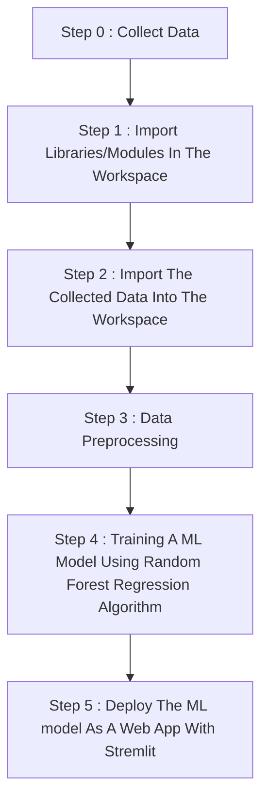

# medical-insurance-prediction
Using Linear Regression algorithm developed a model that will predict the medical insurance cost based on some certain user input parameters like age,gender,BMI,number of children,smoker or not smoker and city.
<h1 align='center'> Work Flow Of This Project </h1>

